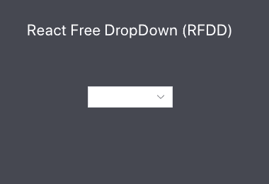

<div align="center">
  
</div>
<h1 align="center">react-free-dropdown <small><sup>(RFDD)</sup></small></h1>
<div align="center">

**Easy custom** dropdown list with [`React`](https://facebook.github.io/react/)

[](https://github.com/flamingotiger/react-free-dropdown/actions)
[](https://www.npmjs.com/package/react-free-dropdown)
[](https://packagephobia.now.sh/result?p=react-free-dropdown)
[](http://npm-stat.com/charts.html?package=react-free-dropdown)

</div>

## Get Started 📦
`react-free-dropdown` install the package.

```shell
npm install react-free-dropdown
```

## Usage 📃

```javascript jsx
import React from 'react';
import { Rfdd, RfddOption } from 'react-free-dropdown';

const App = () => {
  const [value, setValue] = React.useState('');
  return (<>
      <Rfdd onChange={optionValue => setValue(optionValue)}>
        <RfddOption value="Apple">Apple</RfddOption>
        <RfddOption value="Grape">Grape</RfddOption>    
      </Rfdd>
      <p>{value}</p>
    </>);
}

export default App;
```

## Rfdd Property ⛷

| Property  | Type | Descriptions | Example |
| ------------- | ------------- | ------------- | ------------- |
| style  | `React.CSSProperties`  | must be entered as camelcase | `style={{border: '1px solid red'}}` | 
| value | `string` | selected value | `value={value}` |
| children | `React.ReactElement<RfddOptionType, 'RfddOption'>[]` | only use RfddOption component | `<RfddOption>option</RfddOption>`|
| onChange | `(value: string) => void` | change value function | `onChange={(optionValue) => setValue(optionValue)}`|
| mode | `light` or `dark` | light or dark mode | `mode='dark'`|
| hoverStyle | `string` | custom hover style | `hoverStyle='border: 1px solid red;'` |
| optionStyle | `string` | all option custom style | `optionStyle='border: 1px solid red;'` |
| icon | `any` | usage import image `import image from './example.png'` | `icon={image}` |
| hiddenIcon | `boolean` | hidden icon | `hiddenIcon={true}` |

## RfddOption Property 🏂

| Property  | Type | Descriptions | Example |
| ------------- | ------------- | ------------- | ------------- |
| value | `string` | option value | `value='option-value'`|
| style  | `React.CSSProperties`  | must be entered as camelcase | `style={{ border: '1px solid red' }}`|
| children | `React.ReactNode` | option children | `option text or <div>option Element</div>`|
| hoverStyle | `string` | each option custom hover style | `hoverStyle='border: 1px solid red;'` |
| onClick | `() => void` | onChange before active function | `onClick={() => console.log('onClick')}` |

## Preview 🎆



🔎[Play the example](https://react-free-dropdown.netlify.com/?path=/story/drop-down-basic--light-mode)
